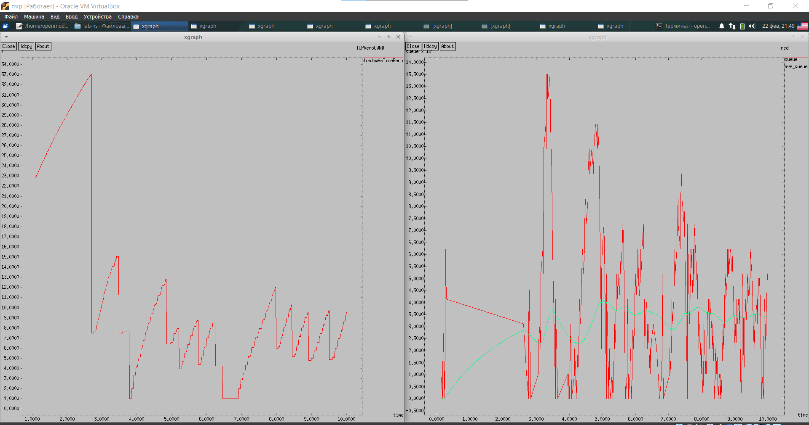
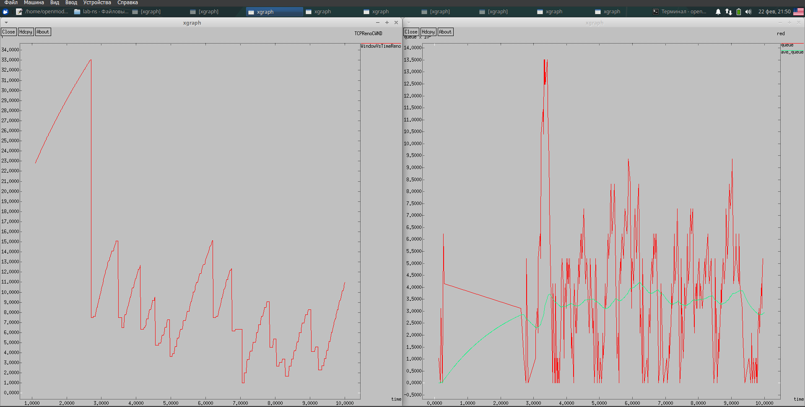
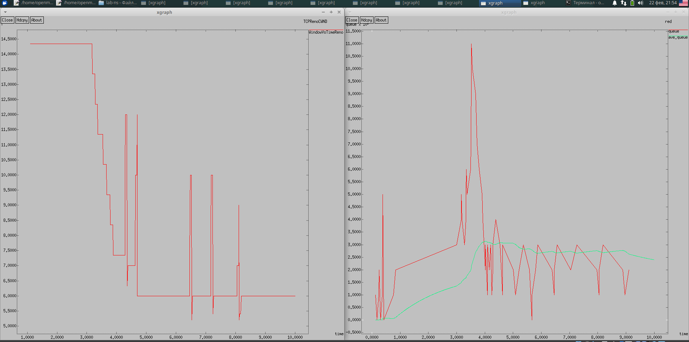
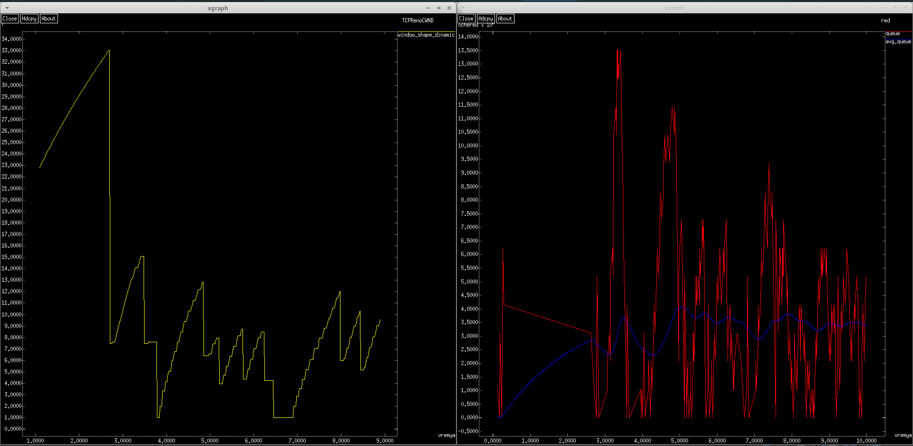

---
## Front matter
title: "Лабораторная работа №2."
subtitle: " Исследование протокола TCP и алгоритма управления очередью RED"
author: "Александр Андреевич Шуплецов"

## Generic otions
lang: ru-RU
toc-title: "Содержание"

## Bibliography
bibliography: bib/cite.bib
csl: pandoc/csl/gost-r-7-0-5-2008-numeric.csl

## Pdf output format
toc: true # Table of contents
toc-depth: 2
lof: true # List of figures
lot: true # List of tables
fontsize: 12pt
linestretch: 1.5
papersize: a4
documentclass: scrreprt
## I18n polyglossia
polyglossia-lang:
  name: russian
  options:
	- spelling=modern
	- babelshorthands=true
polyglossia-otherlangs:
  name: english
## I18n babel
babel-lang: russian
babel-otherlangs: english
## Fonts
mainfont: PT Serif
romanfont: PT Serif
sansfont: PT Sans
monofont: PT Mono
mainfontoptions: Ligatures=TeX
romanfontoptions: Ligatures=TeX
sansfontoptions: Ligatures=TeX,Scale=MatchLowercase
monofontoptions: Scale=MatchLowercase,Scale=0.9
## Biblatex
biblatex: true
biblio-style: "gost-numeric"
biblatexoptions:
  - parentracker=true
  - backend=biber
  - hyperref=auto
  - language=auto
  - autolang=other*
  - citestyle=gost-numeric
## Pandoc-crossref LaTeX customization
figureTitle: "Рис."
tableTitle: "Таблица"
listingTitle: "Листинг"
lofTitle: "Список иллюстраций"
lotTitle: "Список таблиц"
lolTitle: "Листинги"
## Misc options
indent: true
header-includes:
  - \usepackage{indentfirst}
  - \usepackage{float} # keep figures where there are in the text
  - \floatplacement{figure}{H} # keep figures where there are in the text
---

# Цель работы

 Приобретение навыков моделирования сетей передачи данных с помощью средcтва имитационного моделирования NS-2 с дисцплиной RED, а также анализ полученных результатов моделирования.

# Выполнение работы

1. Создадим файл для лабораторной работы 2, пример с дисциплиной RED.

```
#создание объекта Simulator
set ns [new Simulator]

#открытие на запись файла out.nam для визуализатора nam
set nf [open out.nam w]

#все результаты моделирования будут записаны в переменную nf
$ns namtrace-all $nf

#открытие на запись файла трассировки out.tr
#для регистрации всех событий
set f [open out.tr w]
#все регистрируемые события будут записаны в переменную f
$ns trace-all $f

# Процедура finish:
proc finish {} {
	global tchan_
	# подключение кода AWK:
	set awkCode {
		{
			if ($1 == "Q" && NF>2) {
				print $2, $3 >> "temp.q";
				set end $2
			}
			else if ($1 == "a" && NF>2)
			print $2, $3 >> "temp.a";
		}
	}
	set f [open temp.queue w]
	puts $f "TitleText: red"
	puts $f "Device: Postscript"
	if { [info exists tchan_] } {
		close $tchan_
	}
	exec rm -f temp.q temp.a
	exec touch temp.a temp.q
	 # выполнение кода AWK
	exec awk $awkCode all.q
	puts $f \"queue
	exec cat temp.q >@ $f
	puts $f \n\"ave_queue
	exec cat temp.a >@ $f
	close $f
	# Запуск xgraph с графиками окна TCP и очереди:
	exec xgraph -bb -tk -x time -t "TCPRenoCWND" WindowVsTimeReno &
	exec xgraph -bb -tk -x time -y queue temp.queue &
	exit 0
	}

# Формирование файла с данными о размере окна TCP:
proc plotWindow {tcpSource file} {
	global ns
	set time 0.01
	set now [$ns now]
	set cwnd [$tcpSource set cwnd_]
	puts $file "$now $cwnd"
	$ns at [expr $now+$time] "plotWindow $tcpSource $file"
}

# Узлы сети:
set N 5
for {set i 1} {$i < $N} {incr i} {
	set node_(s$i) [$ns node]
}
set node_(r1) [$ns node]
set node_(r2) [$ns node]

# Соединения:
$ns duplex-link $node_(s1) $node_(r1) 10Mb 2ms DropTail
$ns duplex-link $node_(s2) $node_(r1) 10Mb 3ms DropTail
$ns duplex-link $node_(r1) $node_(r2) 1.5Mb 20ms RED
$ns queue-limit $node_(r1) $node_(r2) 25
$ns queue-limit $node_(r2) $node_(r1) 25
$ns duplex-link $node_(s3) $node_(r2) 10Mb 4ms DropTail
$ns duplex-link $node_(s4) $node_(r2) 10Mb 5ms DropTail
# Агенты и приложения:
set tcp1 [$ns create-connection TCP/Reno $node_(s1) TCPSink $node_(s3) 0]
$tcp1 set window_ 15
set tcp2 [$ns create-connection TCP/Reno $node_(s2) TCPSink $node_(s3) 1]
$tcp2 set window_ 15
set ftp1 [$tcp1 attach-source FTP]
set ftp2 [$tcp2 attach-source FTP]

# Мониторинг размера окна TCP:
set windowVsTime [open WindowVsTimeReno w]
set qmon [$ns monitor-queue $node_(r1) $node_(r2) [open qm.out w] 0.1];
[$ns link $node_(r1) $node_(r2)] queue-sample-timeout;
# Мониторинг очереди:
set redq [[$ns link $node_(r1) $node_(r2)] queue]
set tchan_ [open all.q w]
$redq trace curq_
$redq trace ave_
$redq attach $tchan_

#at-событие для планировщика событий, которое запускает
#процедуру finish через 5 с после начала моделирования
# Добавление at-событий:
$ns at 0.0 "$ftp1 start"
$ns at 1.1 "plotWindow $tcp1 $windowVsTime"
$ns at 3.0 "$ftp2 start"
$ns at 10 "finish"
#запуск модели
$ns run
```

2. Запустим файл примера лабораторной работы.

{#fig:001 width=70%}

3. Изменим тип протокола с Reno на Newreno.

```
 Агенты и приложения:
set tcp1 [$ns create-connection TCP/Newreno $node_(s1) TCPSink $node_(s3) 0]
$tcp1 set window_ 15
set tcp2 [$ns create-connection TCP/Newreno $node_(s2) TCPSink $node_(s3) 1]
$tcp2 set window_ 15
set ftp1 [$tcp1 attach-source FTP]
set ftp2 [$tcp2 attach-source FTP]
```

4. Запустим файл с протоколом Newreno.

{#fig:001 width=70%}

5. Изменим тип протокола на Vegas.
```
Агенты и приложения:
set tcp1 [$ns create-connection TCP/Vegas $node_(s1) TCPSink $node_(s3) 0]
$tcp1 set window_ 15
set tcp2 [$ns create-connection TCP/Vegas $node_(s2) TCPSink $node_(s3) 1]
$tcp2 set window_ 15
set ftp1 [$tcp1 attach-source FTP]
set ftp2 [$tcp2 attach-source FTP]
```
6. Запустим файл с протоколом Vegas.

{#fig:001 width=70%}

7. Изменим цвет фона, цвет траекторий, подписи к осям, подпись траектории в легенде.

```
#создание объекта Simulator
set ns [new Simulator]

#открытие на запись файла out.nam для визуализатора nam
set nf [open out.nam w]

#все результаты моделирования будут записаны в переменную nf
$ns namtrace-all $nf

#открытие на запись файла трассировки out.tr
#для регистрации всех событий
set f [open out.tr w]
#все регистрируемые события будут записаны в переменную f
$ns trace-all $f

# Процедура finish:
proc finish {} {
	global tchan_
	# подключение кода AWK:
	set awkCode {
		{
			if ($1 == "Q" && NF>2) {
				print $2, $3 >> "temp.q";
				set end $2
			}
			else if ($1 == "a" && NF>2)
			print $2, $3 >> "temp.a";
		}
	}
set f [open temp.queue w]
puts $f "TitleText: red"
puts $f "Device: Postscript"
puts $f "0.Color: Red"
puts $f "1.Color: Blue"
if { [info exists tchan_] } {
	close $tchan_
}
exec rm -f temp.q temp.a
exec touch temp.a temp.q
 # выполнение кода AWK
exec awk $awkCode all.q
puts $f \"queue"
exec cat temp.q >@ $f
puts $f \n\"avg_queue"
exec cat temp.a >@ $f
close $f
# Запуск xgraph с графиками окна TCP и очереди:
exec xgraph -fg white -bg black -bb -tk -x vremya -t "TCPRenoCWND" WindowVsTimeReno &
exec xgraph -fg white -bg black -bb -tk -x vremya -y ochered temp.queue &
}
# Формирование файла с данными о размере окна TCP:
proc plotWindow {tcpSource file} {
	global ns
	set time 0.01
	set now [$ns now]
	set cwnd [$tcpSource set cwnd_]
	puts $file "$now $cwnd"
	$ns at [expr $now+$time] "plotWindow $tcpSource $file"
}

# Узлы сети:
set N 5
for {set i 1} {$i < $N} {incr i} {
	set node_(s$i) [$ns node]
}
set node_(r1) [$ns node]
set node_(r2) [$ns node]

# Соединения:
$ns duplex-link $node_(s1) $node_(r1) 10Mb 2ms DropTail
$ns duplex-link $node_(s2) $node_(r1) 10Mb 3ms DropTail
$ns duplex-link $node_(r1) $node_(r2) 1.5Mb 20ms RED
$ns queue-limit $node_(r1) $node_(r2) 25
$ns queue-limit $node_(r2) $node_(r1) 25
$ns duplex-link $node_(s3) $node_(r2) 10Mb 4ms DropTail
$ns duplex-link $node_(s4) $node_(r2) 10Mb 5ms DropTail
# Агенты и приложения:
set tcp1 [$ns create-connection TCP/Reno $node_(s1) TCPSink $node_(s3) 0]
$tcp1 set window_ 15
set tcp2 [$ns create-connection TCP/Reno $node_(s2) TCPSink $node_(s3) 1]
$tcp2 set window_ 15
set ftp1 [$tcp1 attach-source FTP]
set ftp2 [$tcp2 attach-source FTP]

# Мониторинг размера окна TCP:
set windowVsTime [open WindowVsTimeReno w]
puts $windowVsTime "0.Color: Yellow"
puts $windowVsTime \"window_shape_dinamic
# Мониторинг очереди:
set redq [[$ns link $node_(r1) $node_(r2)] queue]
set tchan_ [open all.q w]
$redq trace curq_
$redq trace ave_
$redq attach $tchan_

#at-событие для планировщика событий, которое запускает
#процедуру finish через 5 с после начала моделирования
# Добавление at-событий:
$ns at 0.0 "$ftp1 start"
$ns at 1.1 "plotWindow $tcp1 $windowVsTime"
$ns at 3.0 "$ftp2 start"
$ns at 10 "finish"
#запуск модели
$ns run
```
8. Выведем на экран результаты измененного файла.

{#fig:001 width=70%}

# Выводы

Я приобрел навыки моделирования сетей передачи данных с помощью средcтва имитационного моделирования NS-2 и примера с дисциплиной RED, а также сделал анализ полученных результатов моделирования.

# Список литературы{.unnumbered}

Королькова А. В., Кулябов Д.С. "Материалы к лабораторным работам"
