---
## Front matter
lang: ru-RU
title: Лабораторная работа №6
subtitle: Модель хищник-жертва
author:
  - Шуплецов А. А.
institute:
  - Российский университет дружбы народов, Москва, Россия
date: 15 марта 2025

## i18n babel
babel-lang: russian
babel-otherlangs: english

## Formatting pdf
toc: false
toc-title: Содержание
slide_level: 2
aspectratio: 169
section-titles: true
theme: metropolis
header-includes:
 - \metroset{progressbar=frametitle,sectionpage=progressbar,numbering=fraction}
 - '\makeatletter'
 - '\beamer@ignorenonframefalse'
 - '\makeatother'
---

# Информация

## Докладчик

  * Шуплецов Александр Андреевич
  * студент ФФМиЕН
  * Российский университет дружбы народов
  * https://github.com/winnralex

## Цель работы

Исследование модели хищник–жертва с помощью xcos и OpenModelica.

## Выполнение лабораторной работы

## Зафиксируем начальные параметры в меню *Моделирование, Задать переменные окружения*, а затем построим модель при помощи блоков моделирования.

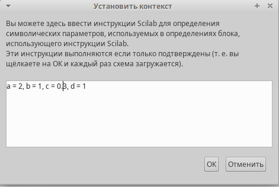{#fig:001 width=50%}

## Зафиксируем начальные параметры в меню *Моделирование, Задать переменные окружения*, а затем построим модель при помощи блоков моделирования.

{#fig:002 width=70%}

## Зафиксируем начальные значения.

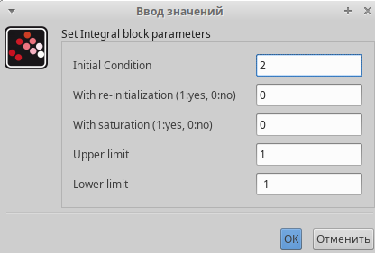{#fig:003 width=70%}

## Зафиксируем начальные значения.

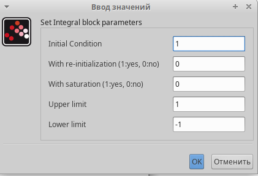{#fig:004 width=70%}

## Также зададим время интегрирования равное 30.

{#fig:005 width=70%}

## В результате получим решение системы хищник-жертва и фазовый портрет.

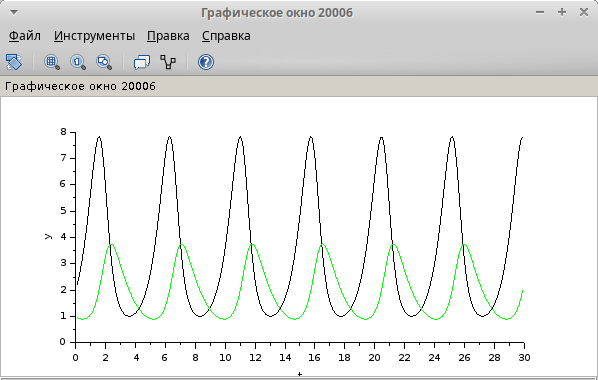{#fig:006 width=70%}

## В результате получим решение системы хищник-жертва и фазовый портрет(рис. [-@fig:006], [-@fig:007]).

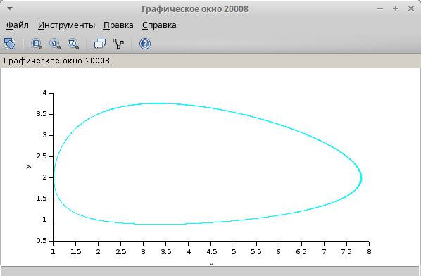{#fig:007 width=70%}

## Для реализации модели с помощью языка Modelica помимо блоков CLOCK_c, CSCOPE, TEXT_f, MUX и CSCOPXY требуются блоки CONST_m -- задаёт константу; MBLOCK(Modelica generic) -- блок реализации кода на языке Modelica.

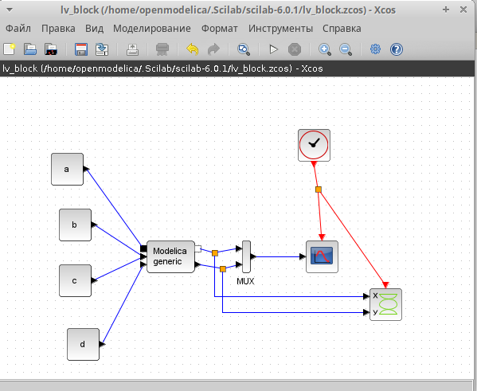{#fig:008 width=70%}

## Задаём значения переменных $\beta$ и $\nu$. Параметры блока Modelica переменные на входе (“beta”, “nu”) и выходе (“s”, “i”, “r”) блока заданы как внешние (“E”).Затем прописываем дифференциальное уравнение.

{#fig:009 width=70%}

## Результаты моделирования совпадают.

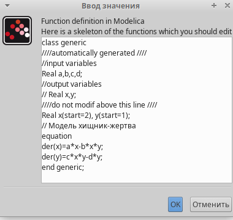{#fig:010 width=70%}

## Реализуем модель в OpenModelica. Для этого создадим файл модели, пропишем там параметры и начальные условие, а также дифференциальное уравнение.

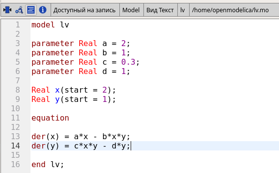{#fig:011 width=70%}

## Затем укажем параметры моделирование, время также поставим равным 30.

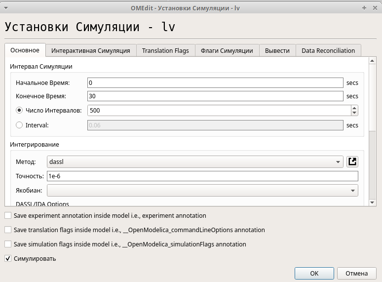{#fig:012 width=65%}

## В результате получим график аналогичный графикам в xcos.

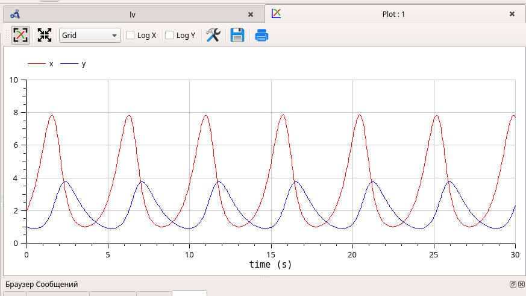{#fig:013 width=70%}

## В результате получим график аналогичный графикам в xcos.

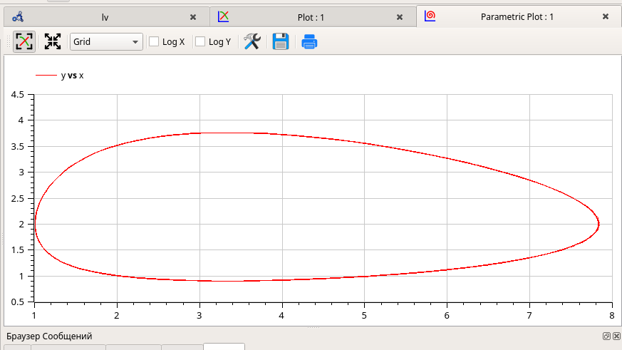{#fig:014 width=70%}

## Выводы

В результате выполнения работы я исследовал модель хищник-жертва при помощи xcos и OpenModelica.

## Список литературы{.unnumbered}

Королькова А. В., Кулябов Д.С. "Материалы к лабораторным работам"
