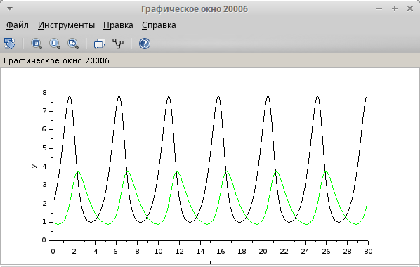

---
## Front matter
title: "Лабораторная работа № 6"
subtitle: "Модель хищник–жертва"
author: "Шуплецов Александр Андреевич"

## Generic otions
lang: ru-RU
toc-title: "Содержание"

## Bibliography
bibliography: bib/cite.bib
csl: pandoc/csl/gost-r-7-0-5-2008-numeric.csl

## Pdf output format
toc: true # Table of contents
toc-depth: 2
lof: true # List of figures
lot: false # List of tables
fontsize: 12pt
linestretch: 1.5
papersize: a4
documentclass: scrreprt
## I18n polyglossia
polyglossia-lang:
  name: russian
  options:
	- spelling=modern
	- babelshorthands=true
polyglossia-otherlangs:
  name: english
## I18n babel
babel-lang: russian
babel-otherlangs: english
## Fonts
mainfont: PT Serif
romanfont: PT Serif
sansfont: PT Sans
monofont: PT Mono
mainfontoptions: Ligatures=TeX
romanfontoptions: Ligatures=TeX
sansfontoptions: Ligatures=TeX,Scale=MatchLowercase
monofontoptions: Scale=MatchLowercase,Scale=0.9
## Biblatex
biblatex: true
biblio-style: "gost-numeric"
biblatexoptions:
  - parentracker=true
  - backend=biber
  - hyperref=auto
  - language=auto
  - autolang=other*
  - citestyle=gost-numeric
## Pandoc-crossref LaTeX customization
figureTitle: "Рис."
tableTitle: "Таблица"
listingTitle: "Листинг"
lofTitle: "Список иллюстраций"
lotTitle: "Список таблиц"
lolTitle: "Листинги"
## Misc options
indent: true
header-includes:
  - \usepackage{indentfirst}
  - \usepackage{float} # keep figures where there are in the text
  - \floatplacement{figure}{H} # keep figures where there are in the text
---

# Цель работы

Исследование модели хищник–жертва с помощью xcos и OpenModelica.

# Выполнение лабораторной работы

Зафиксируем начальные параметры в меню *Моделирование, Задать переменные окружения*, а затем построим модель при помощи блоков моделирования(рис. [-@fig:001], [-@fig:002]).

{#fig:001 width=50%}

{#fig:002 width=70%}

Зафиксируем начальные значения(рис. [-@fig:003], [-@fig:004]).

{#fig:003 width=70%}

{#fig:004 width=70%}

Также зададим время интегрирования равное 30(рис. [-@fig:005]).

{#fig:005 width=70%}

В результате получим решение системы хищник-жертва и фазовый портрет(рис. [-@fig:006], [-@fig:007]).

{#fig:006 width=70%}

{#fig:007 width=70%}

Для реализации модели с помощью языка Modelica помимо блоков CLOCK_c, CSCOPE, TEXT_f, MUX и CSCOPXY требуются блоки CONST_m -- задаёт константу; MBLOCK(Modelica generic) -- блок реализации кода на языке Modelica(рис. [-@fig:008]).

{#fig:008 width=70%}

Задаём значения переменных $\beta$ и $\nu$. Параметры блока Modelica переменные на входе (“beta”, “nu”) и выходе (“s”, “i”, “r”) блока заданы как внешние (“E”).Затем прописываем дифференциальное уравнение(рис. [-@fig:009], [-@fig:010]).

{#fig:009 width=70%}

{#fig:010 width=70%}

Результаты моделирования совпадают с рис. [~@fig:006] и рис. [~@fig:007].

Реализуем модель в OpenModelica. Для этого создадим файл модели, пропишем там параметры и начальные условие, а также дифференциальное уравнение(рис. [-@fig:011]).

{#fig:011 width=70%}

Затем укажем параметры моделирование, время также поставим равным 30(рис. [-@fig:012]).

{#fig:012 width=65%}

В результате получим график аналогичный графикам в xcos(рис. [-@fig:013], [~@fig:014]).

{#fig:013 width=70%}

{#fig:014 width=70%}

# Выводы

В результате выполнения работы я исследовал модель хищник-жертва при помощи xcos и OpenModelica.
