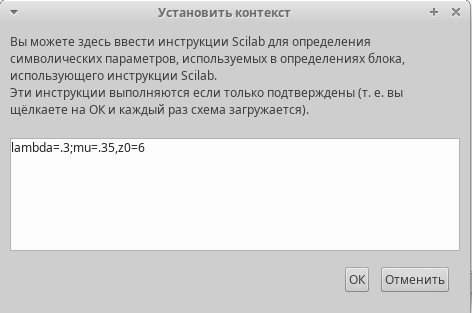
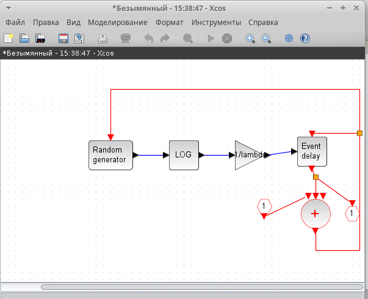
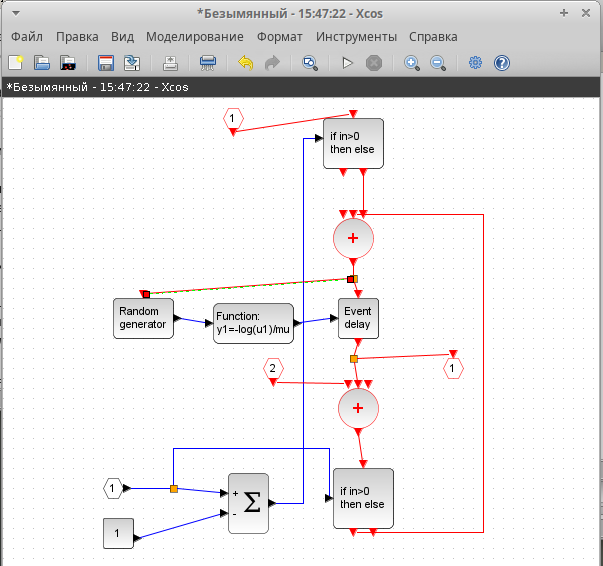
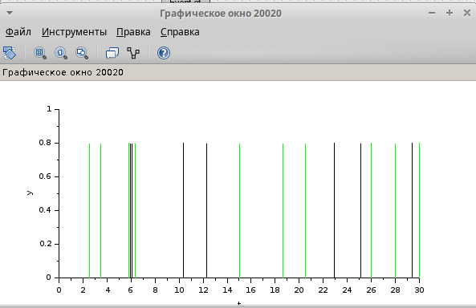

---
## Front matter
lang: ru-RU
title: Лабораторная работа №7
subtitle: Модель mm1
author:
  - Шуплецов А. А.
institute:
  - Российский университет дружбы народов, Москва, Россия
date: 22 марта 2025

## i18n babel
babel-lang: russian
babel-otherlangs: english

## Formatting pdf
toc: false
toc-title: Содержание
slide_level: 2
aspectratio: 169
section-titles: true
theme: metropolis
header-includes:
 - \metroset{progressbar=frametitle,sectionpage=progressbar,numbering=fraction}
 - '\makeatletter'
 - '\beamer@ignorenonframefalse'
 - '\makeatother'
---

# Информация

## Докладчик

  * Шуплецов Александр Андреевич
  * студент ФФМиЕН
  * Российский университет дружбы народов
  * https://github.com/winnralex

## Цели и задачи

Реализовать модель $M|M|1|\infty$ с помощью xcos.

## Выполнение лабораторной работы

## Реализация модели в xcos

## В нашей модели одна очередь, поступление заявок описывается пуассоновским процессом.

Зададим переменное окружение(рис. [-@fig:001]).

{#fig:001 width=70%}

## Далее приведены блоки и их связь для моделирования рассматриваемой системы.

В нашей модели есть суперблок для описания поступления заявок(рис. [-@fig:002]):

{#fig:002 width=70%}

- RAND_M -- генератор случайных чисел по равномерному распределению.
- LOGBLCK_f -- взятие логарифма от потока выхода случайных чисел, чтобы получить Пуассоновское распределение.
- GAINBLCK_f -- умножает сгенерированный поток по Пуассоновскому распределению на $- \dfrac{1}{\lambda}$
- EVTGEN_f -- обработчик событий, так как для моделирования заявок будут использованы события.
- CLKSOMV_f -- синхронизация выходных и входных сигналов.
- CLKINV_f -- порт входа в суперблок.
- CLKOUTV_f -- порт выхода из суперблок.

## Также есть суперблок, описывающий обработку заявок(рис. [-@fig:003]):

{#fig:003 width=70%}

- RAND_M -- генератор случайных чисел по равномерному распределению.
sci_funk_m_block -- задает математическое выражение $y1=-log(u1)/mu$, которое ранее мы задавали блоками.
- EVTGEN_f -- обработчик событий, так как для моделирования заявок будут использованы события.
- CLKSOMV_f -- синхронизация выходных и входных сигналов. В этом суперблоке их два. 
- IFHEL_f -- два блока для определения длины очереди, если значение больше нуля, то сигнал подается.
- CLKINV_f -- входы для запуска и для сообщения о том, что сообщение пришло в очередь, чтобы по разному обрабатывать пустую и не пустую очередь.
- IN_f, CONST_M -- проверка на длину очереди

## Вся модель выглядит следующим образом(рис. [-@fig:004]):

{#fig:004 width=70%}

- SELECTOR_M -- берёт входные сигналы и с помощью управляющих сигналов будет добавлять вход к очереди, либо считывать. У него три входа -- для поступления заявок, обработки заявок и начальной синхронизации.
- CONST_M -- поступление заявки выражается 1, обслуживание заявки -- -1, первоначальная синхронизация -- 0.
- EVTGEN_f -- запуск первоначального события в нулевой момент времени.
- DOLLAR_f -- блок для иммитации очереди, на него приходит управление, которое синхронизируется с источника и с обработчика.
- CSCOPE -- для отрисовки длины очереди.
- CEVEBTSCOPE -- обработка событий.

## В результате получим два графика: один показывает поступление и обработку заявок, а второй изменение длины очереди(рис. [-@fig:005], [-@fig:006]).

{#fig:005 width=70%}

{#fig:006 width=70%}

## Выводы

В результате выполнения работы была реализована модель $M|M|1|\infty$ с помощью xcos.

## Список литературы{.unnumbered}

Королькова А. В., Кулябов Д.С. "Материалы к лабораторным работам"
