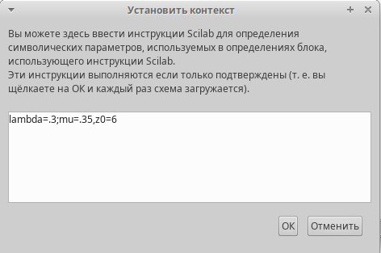
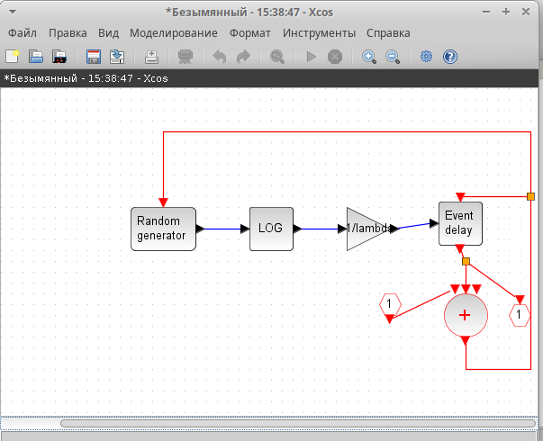
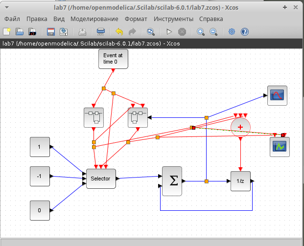
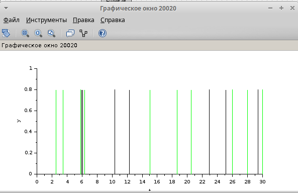
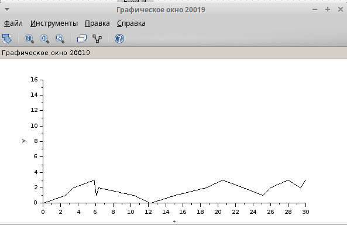

---
## Front matter
title: "Лабораторная работа № 7"
subtitle: "Модель mm1"
author: "Шуплецов Александр"

## Generic otions
lang: ru-RU
toc-title: "Содержание"

## Bibliography
bibliography: bib/cite.bib
csl: pandoc/csl/gost-r-7-0-5-2008-numeric.csl

## Pdf output format
toc: true # Table of contents
toc-depth: 2
lof: true # List of figures
lot: false # List of tables
fontsize: 12pt
linestretch: 1.5
papersize: a4
documentclass: scrreprt
## I18n polyglossia
polyglossia-lang:
  name: russian
  options:
	- spelling=modern
	- babelshorthands=true
polyglossia-otherlangs:
  name: english
## I18n babel
babel-lang: russian
babel-otherlangs: english
## Fonts
mainfont: PT Serif
romanfont: PT Serif
sansfont: PT Sans
monofont: PT Mono
mainfontoptions: Ligatures=TeX
romanfontoptions: Ligatures=TeX
sansfontoptions: Ligatures=TeX,Scale=MatchLowercase
monofontoptions: Scale=MatchLowercase,Scale=0.9
## Biblatex
biblatex: true
biblio-style: "gost-numeric"
biblatexoptions:
  - parentracker=true
  - backend=biber
  - hyperref=auto
  - language=auto
  - autolang=other*
  - citestyle=gost-numeric
## Pandoc-crossref LaTeX customization
figureTitle: "Рис."
tableTitle: "Таблица"
listingTitle: "Листинг"
lofTitle: "Список иллюстраций"
lotTitle: "Список таблиц"
lolTitle: "Листинги"
## Misc options
indent: true
header-includes:
  - \usepackage{indentfirst}
  - \usepackage{float} # keep figures where there are in the text
  - \floatplacement{figure}{H} # keep figures where there are in the text
---

# Цели и задачи

Реализовать модель $M|M|1|\infty$ с помощью xcos.

# Выполнение лабораторной работы

## Реализация модели в xcos

В нашей модели одна очередь, поступление заявок описывается пуассоновским процессом.

Зададим переменное окружение(рис. [-@fig:001]).

{#fig:001 width=70%}

Далее приведены блоки и их связь для моделирования рассматриваемой системы.

В нашей модели есть суперблок для описания поступления заявок(рис. [-@fig:002]):

{#fig:002 width=70%}

- RAND_M -- генератор случайных чисел по равномерному распределению.
- LOGBLCK_f -- взятие логарифма от потока выхода случайных чисел, чтобы получить Пуассоновское распределение.
- GAINBLCK_f -- умножает сгенерированный поток по Пуассоновскому распределению на $- \dfrac{1}{\lambda}$
- EVTGEN_f -- обработчик событий, так как для моделирования заявок будут использованы события.
- CLKSOMV_f -- синхронизация выходных и входных сигналов.
- CLKINV_f -- порт входа в суперблок.
- CLKOUTV_f -- порт выхода из суперблок.

Также есть суперблок, описывающий обработку заявок(рис. [-@fig:003]):

{#fig:003 width=70%}

- RAND_M -- генератор случайных чисел по равномерному распределению.
sci_funk_m_block -- задает математическое выражение $y1=-log(u1)/mu$, которое ранее мы задавали блоками.
- EVTGEN_f -- обработчик событий, так как для моделирования заявок будут использованы события.
- CLKSOMV_f -- синхронизация выходных и входных сигналов. В этом суперблоке их два. 
- IFHEL_f -- два блока для определения длины очереди, если значение больше нуля, то сигнал подается.
- CLKINV_f -- входы для запуска и для сообщения о том, что сообщение пришло в очередь, чтобы по разному обрабатывать пустую и не пустую очередь.
- IN_f, CONST_M -- проверка на длину очереди

Вся модель выглядит следующим образом(рис. [-@fig:004]):

{#fig:004 width=70%}

- SELECTOR_M -- берёт входные сигналы и с помощью управляющих сигналов будет добавлять вход к очереди, либо считывать. У него три входа -- для поступления заявок, обработки заявок и начальной синхронизации.
- CONST_M -- поступление заявки выражается 1, обслуживание заявки -- -1, первоначальная синхронизация -- 0.
- EVTGEN_f -- запуск первоначального события в нулевой момент времени.
- DOLLAR_f -- блок для иммитации очереди, на него приходит управление, которое синхронизируется с источника и с обработчика.
- CSCOPE -- для отрисовки длины очереди.
- CEVEBTSCOPE -- обработка событий.

В результате получим два графика: один показывает поступление и обработку заявок, а второй изменение длины очереди(рис. [-@fig:005], [-@fig:006]).

{#fig:005 width=70%}

{#fig:006 width=70%}

# Выводы

В результате выполнения работы была реализована модель $M|M|1|\infty$ с помощью xcos.
