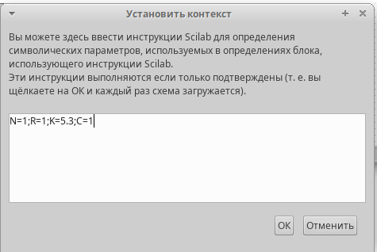
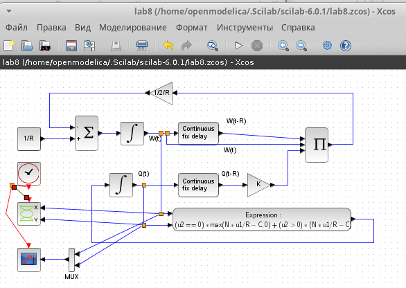
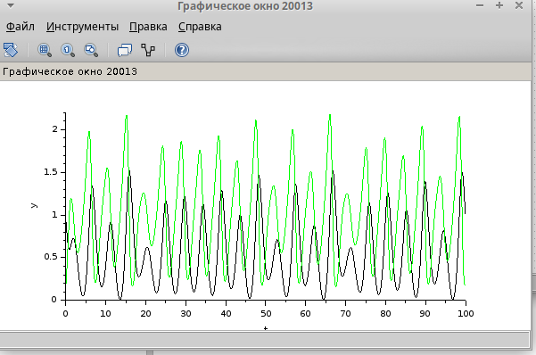
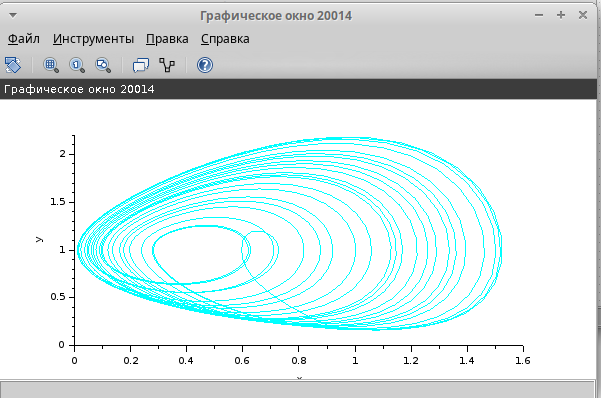
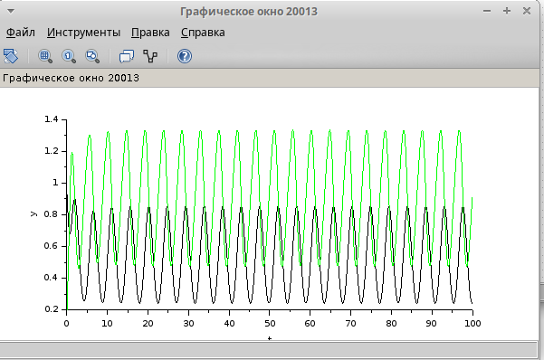
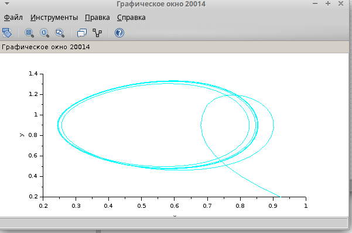
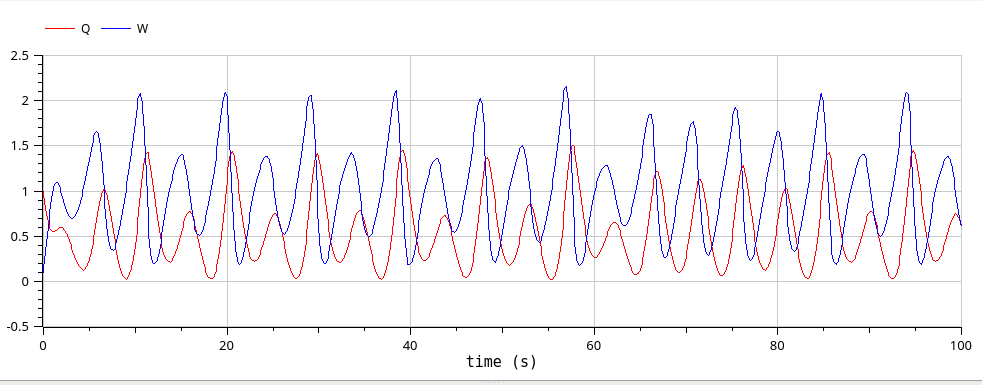
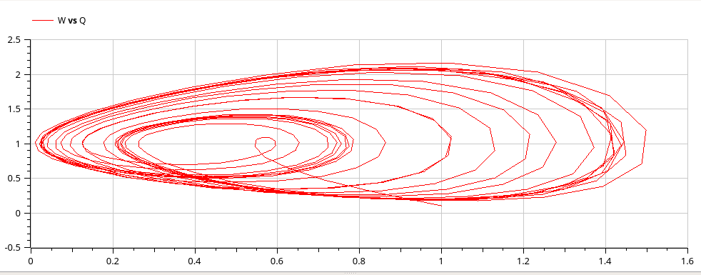

---
## Front matter
lang: ru-RU
title: Лабораторная работа №8
subtitle: Модель TCP/AQM
author:
  - Шуплецов А. А.
institute:
  - Российский университет дружбы народов, Москва, Россия
date: 29 марта 2025

## i18n babel
babel-lang: russian
babel-otherlangs: english

## Formatting pdf
toc: false
toc-title: Содержание
slide_level: 2
aspectratio: 169
section-titles: true
theme: metropolis
header-includes:
 - \metroset{progressbar=frametitle,sectionpage=progressbar,numbering=fraction}
 - '\makeatletter'
 - '\beamer@ignorenonframefalse'
 - '\makeatother'
---

# Информация

## Докладчик

  * Шуплецов Александр Андреевич
  * студент ФФМиЕН
  * Российский университет дружбы народов
  * https://github.com/winnralex

## Цели и задачи

Реализовать модель TCP/AQM с помощью xcos и OpenModelica.

## Реализация модели в xcos

## Зададим переменное окружение.

{#fig:001 width=70%}

## Затем реализуем модель TCP/AQM и разместим регистрирующие устройства:

{#fig:002 width=70%}

## Получим динамику изменения размера TCP окна W(t)(зеленая линия) и размера очереди Q(t)(черная линия), а также фазовый портрет:

{#fig:003 width=70%}

## Получим фазовый портрет.

{#fig:004 width=70%}

## Уменьшив скорость обработки пакетов C до 0.9 можно увидеть, что автоколебания стали более выраженными.

{#fig:005 width=70%}

## Получим фазовый портрет

{#fig:006 width=70%}

## Реализация модели в OpenModelica

## Перейдем к реализации модели в OpenModelica. Зададим параметры, переменные и систему уравнений:

{#fig:007 width=70%}

## Затем установим параметры симуляции.

{#fig:008 width=70%}

## Получим динамику изменения размера TCP окна W(t)(зеленая линия) и размера очереди Q(t)(черная линия), а также фазовый портрет, который показывает наличие автоколебаний параметров системы — фазовая траектория осциллирует вокруг своей стационарной точки:

{#fig:009 width=70%}

## Фазовый портрет.

{#fig:010 width=70%}

## Выводы

В результате выполнения работы я реализовал модель TCP/AQM с помощью xcos и OpenModelica.

## Список литературы{.unnumbered}

Королькова А. В., Кулябов Д.С. "Материалы к лабораторным работам"
