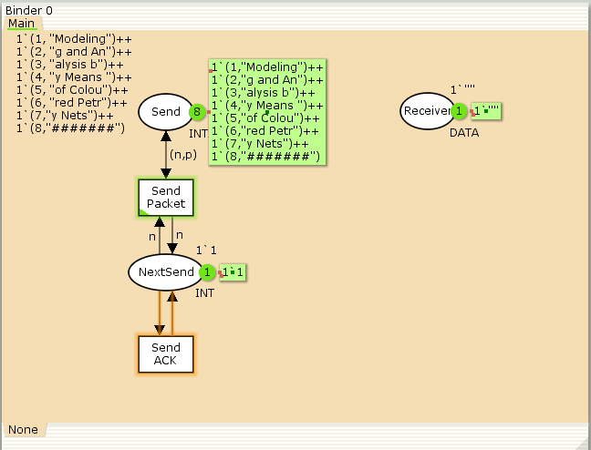

---
## Front matter
lang: ru-RU
title: Лабораторная работа №12
subtitle: Пример моделирования простого протокола передачи данных
author:
  - Шуплецов А. А.
institute:
  - Российский университет дружбы народов, Москва, Россия
date: 26 апреля 2025

## i18n babel
babel-lang: russian
babel-otherlangs: english

## Formatting pdf
toc: false
toc-title: Содержание
slide_level: 2
aspectratio: 169
section-titles: true
theme: metropolis
header-includes:
 - \metroset{progressbar=frametitle,sectionpage=progressbar,numbering=fraction}
 - '\makeatletter'
 - '\beamer@ignorenonframefalse'
 - '\makeatother'
---

# Информация

## Докладчик

  * Шуплецов Александр Андреевич
  * студент ФФМиЕН
  * Российский университет дружбы народов
  * https://github.com/winnralex

## Цели и задачи

Реализовать в CPN Tools простой протокол передачи данных и провести анализ его пространства состояний.

## Реализация задачи в CPN Tools

{#fig:001 width=70%}

## Построим начальный граф:

{#fig:002 width=70%}

## Зададим промежуточные состояния (A, B с типом INTxDATA, C, D с типом INTxDATA) для переходов.  На переходах Transmit Packet и Transmit ACK зададим потерю пакетов. Для этого на интервале от 0 до 10 зададим пороговое значение и, если передаваемое значение превысит этот порог, то считаем, что произошла потеря пакета, если нет, то передаём пакет дальше. Для этого задаём вспомогательные состояния SP и SA с типом Ten0 и начальным значением 1`8, соединяем с соответствующими переходами:

{#fig:003 width=70%}

## В декларациях задаём:

{#fig:004 width=70%}

## Таким образом, получим модель простого протокола передачи данных.

{#fig:005 width=70%}

## Сформируем начало графа пространства состояний:

{#fig:006 width=70%}

## Выводы

В результате выполнения работы я реализовал в CPN Tools простой протокол передачи данных и провел анализ его пространства состояний.

## Список литературы

Королькова А. В., Кулябов Д.С. "Материалы к лабораторным работам"
