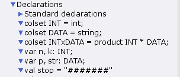
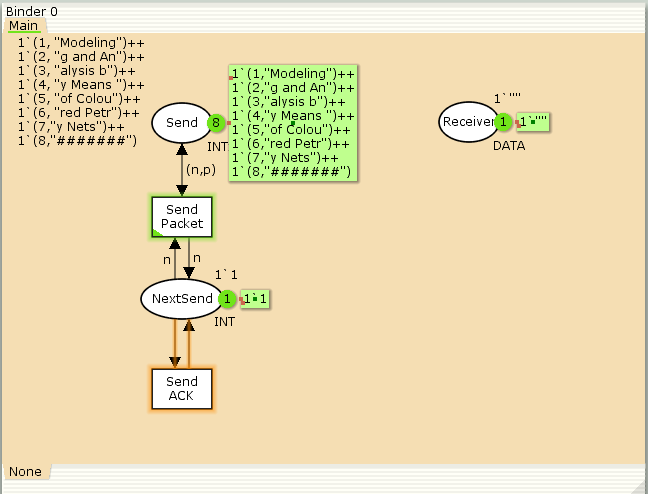
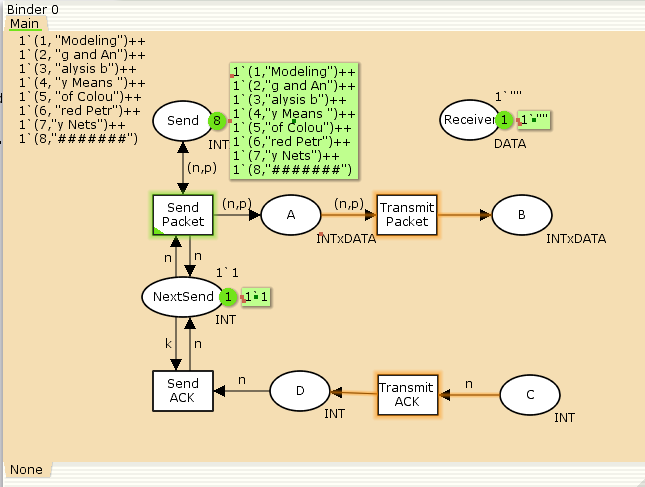
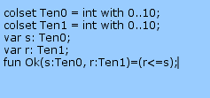
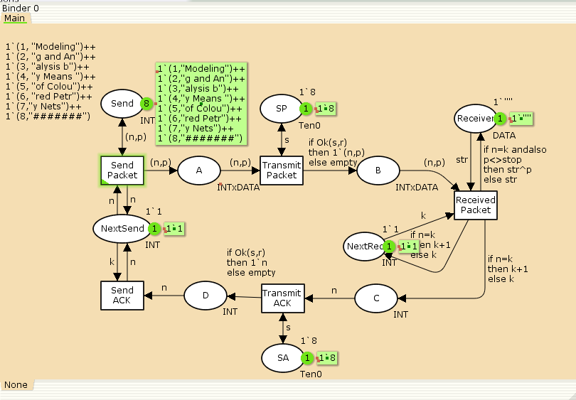
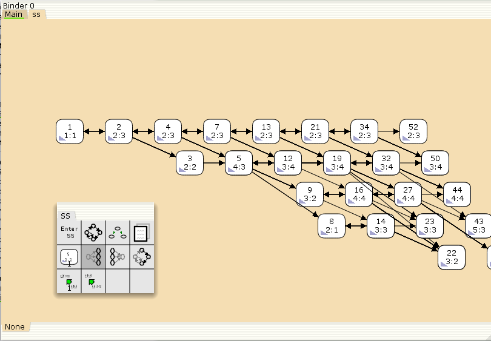

---
## Front matter
title: "Лабораторная работа № 12"
subtitle: "Пример моделирования простого протокола передачи данных"
author: "Шуплецов Александр Андреевич"

## Generic otions
lang: ru-RU
toc-title: "Содержание"

## Bibliography
bibliography: bib/cite.bib
csl: pandoc/csl/gost-r-7-0-5-2008-numeric.csl

## Pdf output format
toc: true # Table of contents
toc-depth: 2
lof: true # List of figures
lot: false # List of tables
fontsize: 12pt
linestretch: 1.5
papersize: a4
documentclass: scrreprt
## I18n polyglossia
polyglossia-lang:
  name: russian
  options:
	- spelling=modern
	- babelshorthands=true
polyglossia-otherlangs:
  name: english
## I18n babel
babel-lang: russian
babel-otherlangs: english
## Fonts
mainfont: PT Serif
romanfont: PT Serif
sansfont: PT Sans
monofont: PT Mono
mainfontoptions: Ligatures=TeX
romanfontoptions: Ligatures=TeX
sansfontoptions: Ligatures=TeX,Scale=MatchLowercase
monofontoptions: Scale=MatchLowercase,Scale=0.9
## Biblatex
biblatex: true
biblio-style: "gost-numeric"
biblatexoptions:
  - parentracker=true
  - backend=biber
  - hyperref=auto
  - language=auto
  - autolang=other*
  - citestyle=gost-numeric
## Pandoc-crossref LaTeX customization
figureTitle: "Рис."
tableTitle: "Таблица"
listingTitle: "Листинг"
lofTitle: "Список иллюстраций"
lotTitle: "Список таблиц"
lolTitle: "Листинги"
## Misc options
indent: true
header-includes:
  - \usepackage{indentfirst}
  - \usepackage{float} # keep figures where there are in the text
  - \floatplacement{figure}{H} # keep figures where there are in the text
---

# Введение

## Цели и задачи

**Цель работы**

Реализовать в CPN Tools простой протокол передачи данных и провести анализ его пространства состояний.

# Выполнение лабораторной работы

## Реализация задачи в CPN Tools

Основные состояния: источник (Send), получатель (Receiver).
Действия (переходы): отправить пакет (Send Packet), отправить подтверждение (Send ACK).
Промежуточное состояние: следующий посылаемый пакет (NextSend).
Зададим декларации модели.

{#fig:001 width=70%}

Состояние Send имеет тип INTxDATA и следующую начальную маркировку (в соответствии с передаваемой фразой).

Стоповый байт ("########") определяет, что сообщение закончилось. Состояние Receiver имеет тип DATA и начальное значение 1'"" (т.е. пустая строка, поскольку состояние собирает данные и номер пакета его не интересует). Состояние NextSend имеет тип INT и начальное значение 1'1. Поскольку пакеты представляют собой кортеж, состоящий из номера пакета и строки, то выражение у двусторонней дуги будет иметь значение (n,p). Кроме того, необходимо взаимодействовать с состоянием, которое будет сообщать номер следующего посылаемого пакета данных. Поэтому переход Send Packet соединяем с состоянием NextSend двумя дугами с выражениями n (рис. 12.1). Также необходимо получать информацию с подтверждениями о получении данных. От перехода Send Packet к состоянию NextSend дуга с выражением n, обратно -- k.

Построим начальный граф:

{#fig:002 width=70%}

Зададим промежуточные состояния (A, B с типом INTxDATA, C, D с типом INTxDATA) для переходов.  На переходах Transmit Packet и Transmit ACK зададим потерю пакетов. Для этого на интервале от 0 до 10 зададим пороговое значение и, если передаваемое значение превысит этот порог, то считаем, что произошла потеря пакета, если нет, то передаём пакет дальше. Для этого задаём вспомогательные состояния SP и SA с типом Ten0 и начальным значением 1`8, соединяем с соответствующими переходами:

{#fig:003 width=70%}

В декларациях задаём:

{#fig:004 width=70%}

Таким образом, получим модель простого протокола передачи данных.
Пакет последовательно проходит: состояние Send, переход Send Packet, состоя-
ние A, с некоторой вероятностью переход Transmit Packet, состояние B, попадает
на переход Receive Packet, где проверяется номер пакета и если нет совпадения,
то пакет направляется в состояние Received, а номер пакета передаётся после-
довательно в состояние C, с некоторой вероятностью в переход Transmit ACK,
далее в состояние D, переход Receive ACK, состояние NextSend (увеличивая на 1
номер следующего пакета), переход Send Packet. Так продолжается до тех пор,
пока не будут переданы все части сообщения. Последней будет передана стоп-
последовательность:

{#fig:005 width=70%}

Сформируем начало графа пространства состояний:

{#fig:006 width=70%}

# Выводы

В результате выполнения работы я реализовал в CPN Tools простой протокол передачи данных и провел анализ его пространства состояний.
