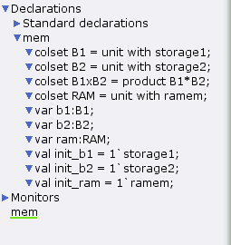
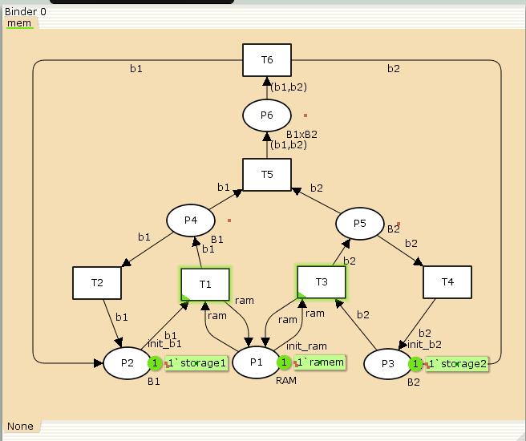
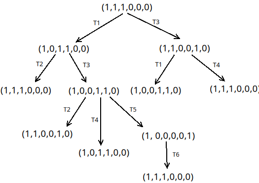

---
## Front matter
lang: ru-RU
title: Лабораторная работа №13
subtitle: Задание для самостоятельного выполнения
author:
  - Шуплецов А. А.
institute:
  - Российский университет дружбы народов, Москва, Россия
date: 3 мая 2025

## i18n babel
babel-lang: russian
babel-otherlangs: english

## Formatting pdf
toc: false
toc-title: Содержание
slide_level: 2
aspectratio: 169
section-titles: true
theme: metropolis
header-includes:
 - \metroset{progressbar=frametitle,sectionpage=progressbar,numbering=fraction}
 - '\makeatletter'
 - '\beamer@ignorenonframefalse'
 - '\makeatother'
---

# Информация

## Докладчик

  * Шуплецов Александр Андреевич
  * студент ФФМиЕН
  * Российский университет дружбы народов
  * https://github.com/winnralex

## Цели и задачи

Реализовать в CPN Tools задание для самостоятельного выполнения.

## Реализация задачи в CPN Tools

## В меню заданы новые декларации модели: типы фишек, начальные значения позиций, выражения для дуг

{#fig:001 width=70%}

## Рисуем граф сети. Для этого с помощью контекстного меню создаём новую сеть, добавляем позиции, переходы и дуги, а также зададим типы данных и начальные состояния:

{#fig:002 width=70%}

## Построим граф достижимости:

{#fig:003 width=70%}

## Сформируем граф пространства состояний, всего их 5(рис. [-@fig:004]):

{#fig:004 width=70%}

## Затем сформируем отчет пространства состояний. Из него может увидеть:

- есть 5 состояний и 10 переходов между ними, strongly connected components (SCC) graph содержит 1 вершину и 0 переходов, так как нет состояний, из которых можно попасть во все остальные.
- Затем указаны границы значений для каждого элемента: состояние P1 всегда заполнено 1 элементом, а остальные содержат максимум 1 элемент, минимум -- 0.
- Также указаны границы в виде мультимножеств.
- Маркировка home для всех состояний, так как в любую позицию мы можем попасть из любой другой маркировки.
- Маркировка dead равная None, так как нет состояний, из которых переходов быть не может.
- В конце указано, что бесконечно часто могут происходить переходы T1, T2, T3, T4, но не обязательно, также состояние T5 необходимо для того, чтобы система не попадала в тупик, то есть были бесконечные циклы, а состояние T6 происходит всегда, если доступно.

## Выводы

В результате выполнения работы я выполнил самостоятельное задание: провел анализ сети Петри, построив ее с помощью CPNTools, и также я построил граф состояний и провел его анализ.

## Список литературы

Королькова А.В., Кулябов Д.С. “Материалы к лабораторным работам”
