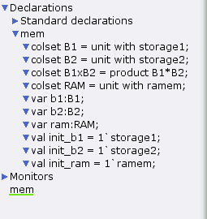
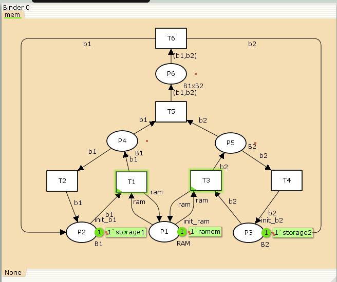
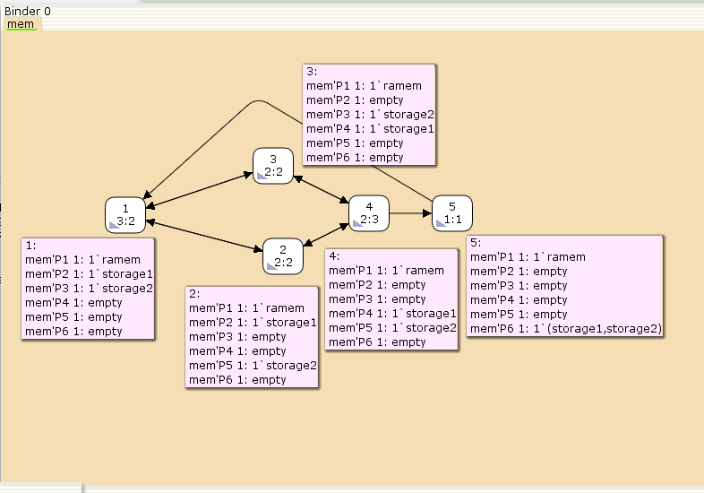

---
## Front matter
title: "Лабораторная работа № 13"
subtitle: "Задание для самостоятельного выполнения"
author: "Шуплецов Александр Андреевич"

## Generic otions
lang: ru-RU
toc-title: "Содержание"

## Bibliography
bibliography: bib/cite.bib
csl: pandoc/csl/gost-r-7-0-5-2008-numeric.csl

## Pdf output format
toc: true # Table of contents
toc-depth: 2
lof: true # List of figures
lot: false # List of tables
fontsize: 12pt
linestretch: 1.5
papersize: a4
documentclass: scrreprt
## I18n polyglossia
polyglossia-lang:
  name: russian
  options:
	- spelling=modern
	- babelshorthands=true
polyglossia-otherlangs:
  name: english
## I18n babel
babel-lang: russian
babel-otherlangs: english
## Fonts
mainfont: PT Serif
romanfont: PT Serif
sansfont: PT Sans
monofont: PT Mono
mainfontoptions: Ligatures=TeX
romanfontoptions: Ligatures=TeX
sansfontoptions: Ligatures=TeX,Scale=MatchLowercase
monofontoptions: Scale=MatchLowercase,Scale=0.9
## Biblatex
biblatex: true
biblio-style: "gost-numeric"
biblatexoptions:
  - parentracker=true
  - backend=biber
  - hyperref=auto
  - language=auto
  - autolang=other*
  - citestyle=gost-numeric
## Pandoc-crossref LaTeX customization
figureTitle: "Рис."
tableTitle: "Таблица"
listingTitle: "Листинг"
lofTitle: "Список иллюстраций"
lotTitle: "Список таблиц"
lolTitle: "Листинги"
## Misc options
indent: true
header-includes:
  - \usepackage{indentfirst}
  - \usepackage{float} # keep figures where there are in the text
  - \floatplacement{figure}{H} # keep figures where there are in the text
---

# Введение

## Цели и задачи

Реализовать в CPN Tools задание для самостоятельного выполнения.

# Выполнение лабораторной работы

## Реализация задачи в CPN Tools

В меню заданы новые декларации модели: типы фишек, начальные значения позиций, выражения для дуг(рис. [-@fig:001]).
- ram -- оперативная память типа RAM;
- b1 -- первое накопительное устройство типа B1;
- b2 -- второе накопительное устройство типа B2;
- B1xB2 -- тип для передачи b1 и b2;
- Начальные состояния P1, P2, P3 содержат один элемент типа RAM, B1, B2 соответственно

{#fig:001 width=70%}

Рисуем граф сети. Для этого с помощью контекстного меню создаём новую сеть, добавляем позиции, переходы и дуги, а также зададим типы данных и начальные состояния(рис. [-@fig:002]):

{#fig:002 width=70%}

Построим граф достижимости(рис. [-@fig:003]):

{#fig:003 width=70%}

Можно увидеть, что рассматриваемая сеть Петри:
- безопасна, так как число фишек в каждой позиции не
может превысить 1;
- ограничена, так как существует такое целое k, что число фишек в каждой позиции не может превысить k(в нашем случае k = 1);
- не имеет тупиков;
- не является сохраняющей, так как при переходе T5 теряется 1 фишка, а при T6 -- порождается;

Сформируем граф пространства состояний, всего их 5(рис. [-@fig:004]):

{#fig:004 width=70%}

Затем сформируем отчет пространства состояний. Из него может увидеть:

- есть 5 состояний и 10 переходов между ними, strongly connected components (SCC) graph содержит 1 вершину и 0 переходов, так как нет состояний, из которых можно попасть во все остальные.
- Затем указаны границы значений для каждого элемента: состояние P1 всегда заполнено 1 элементом, а остальные содержат максимум 1 элемент, минимум -- 0.
- Также указаны границы в виде мультимножеств.
- Маркировка home для всех состояний, так как в любую позицию мы можем попасть из любой другой маркировки.
- Маркировка dead равная None, так как нет состояний, из которых переходов быть не может.
- В конце указано, что бесконечно часто могут происходить переходы T1, T2, T3, T4, но не обязательно, также состояние T5 необходимо для того, чтобы система не попадала в тупик, то есть были бесконечные циклы, а состояние T6 происходит всегда, если доступно.

# Выводы

В результате выполнения работы я выполнил самостоятельное задание: провел анализ сети Петри, построив ее с помощью CPNTools, и также я построил граф состояний и провел его анализ.

# Список литературы

Королькова А.В., Кулябов Д.С. “Материалы к лабораторным работам” 
